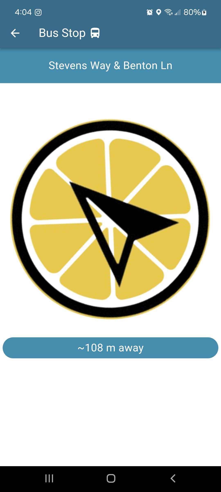

# Lemún 

**App developed by Brian Yu, Rohan Shanthanu, Daniel Gao, and Jacob Marcuson for CSE 340 class at University of Washington**

This is an Android app (iOS version may contain bugs, macOS version confirmed has bugs) targeted towards Seattle commuters who use both public transportation options (i.e. light rail and bus) as well as rental bike and scooter services (i.e. Lime). It functions similar to other map apps where markers are displayed on screen to alert users of nearby transit options. Tapping on a marker will bring up a compass, pointing the user in the direction of their intended ride. Future updates *may* include an expansion to other regions (potentially requiring more API accesses), more marker options, walk routes, schedules, and a transition from `flutter_maps` to Google's mapping widget.

  
   

### Build steps
- Clone this repository.
- Run `flutter pub get` to get flutter packages.
- Run the project using `flutter run`.
- Note: You will have to enable location permissions.
- Once the app is ready, you can pan and zoom the map, click on bikes, scooters, and bus stops for further information, and use the legend to filter by icon type.

### Project structure

#### `lib/assets/`
- `bus_stops.csv` CSV file of Seattle bus stops.
- `lemun_compass.png` Image file for the compass.
#### `lib/helpers/`
- `scooter_checker.dart` Helper to update the list of scooters and bikes near the user.
#### `lib/models/`
- `bus_stop_db.dart` Database of the bus stops, represented as a list of bus stops, created from `bus_stops.csv` in assets.
- `bus_stop.dart` Represents a single bus stop with name and position.
- `city.dart` Enum with all the cities in the Lime API.
- `drawing.dart` Object to hold the draw actions of the user.
- `lime.dart` Object to hold the data of Lime scooters and bikes.
- `link_scooter.dart` Object to hold the data of Link scooters.
- `tools.dart` Enum to determine what tool is being used on the canvas.
- `vehicle_types.dart` Enum for vehicle types (bus, scooter, bike).
- `vehicle.dart` Abstract class to wrap all vehicle types; has basic information of type, latitude, and longitude.
#### `draw_actions/`
- `draw_actions.dart` Superclass to all draw actions.
#### `actions/`
- `clear_action.dart` Used to indicate the canvas was cleared.
- `null_action.dart` Used to indicate no stroke is being registered.
- `stroke_action.dart` Used to indicate user is drawing on the canvas.
#### `lib/providers/`
- `drawing_provider.dart` Used to handle state of the drawing.
- `opacity_provider.dart` Used to handle state of the appbar.
- `position_provider.dart` Used to handle state of the user's position.
- `scooter_provider.dart` Used to handle state of the nearby scooters and bikes.
#### `lib/views/`
- `city_selector.dart` Drawer for a city selection menu.
- `compass_view.dart` Displays compass pointing from user's current position to a specified vehicle's location. Further provides information such as availability and distance from user. 
- `draw_area.dart` Canvas for user to interact with.
- `drawing_painter.dart` Displays user's strokes.
- `home_page.dart` References all other views with logic for switching between them.
- `map_view.dart` Main view of the app, displaying `flutter_map` and a custom legend/filter. Clicking a vehicle marker on the map brings you to the `compass_view` for that marker.
- `palette.dart` Drawer for a colour selection menu.
#### `lib/main.dart`
- Builds the bus db and creates providers for all the data models, calling `home_page` and starting the app.

### Data design and data flow
- No user data is stored by this app. We use Lists to store the bikes, scooters, and bus stops with providers to update the data stored by those lists.
- A provider is used to periodically check the scooter and bike APIs and update the data structures used to populate the app's map.
- A provider is used to manage the state of the entire app (e.g. toggling canvas features).
- A similar provider framework to the one used in the drawing app manages drawing state.
- A position provider is used to update the user's position.

### Read more
- [Peer audit (by Charyl Li)](./docs/audit.md)
- [Project evaluations](./docs/evaluation.md)
- [Project motivation](./docs/need.md)
- [General reflection (including resources used)](./docs/reflection.md)
